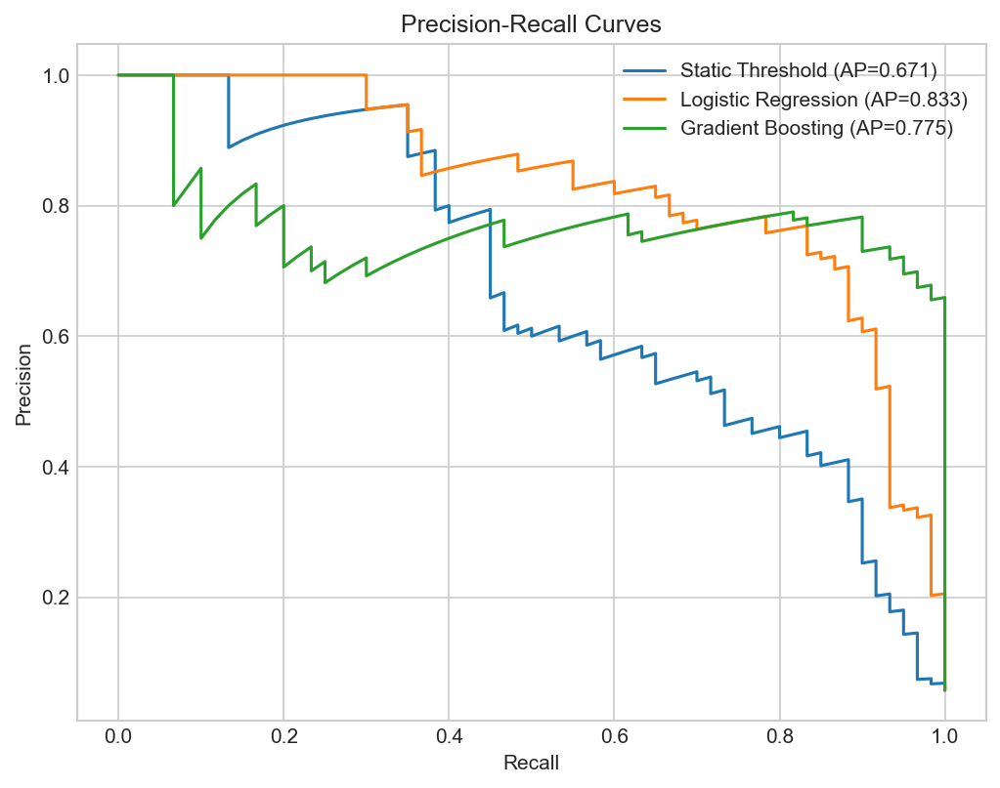
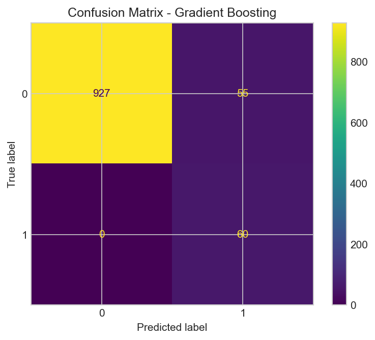
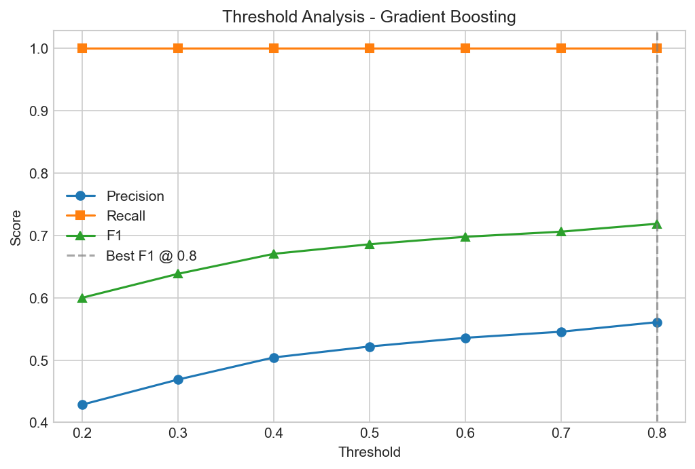

# Incident Prediction from Time-Series Metrics

Sliding-window binary classifier that predicts whether a metric incident
(anomaly/threshold breach) will occur within the next H time steps, given
the previous W steps of data.

Built as a test task for a JetBrains ML internship application.

## Setup

    pip install -r requirements.txt
    python main.py

Optional arguments:

    python main.py --window_size 50 --horizon 10 --seed 42 --output_dir results

## Data

Synthetic single-metric time series, 5000 steps, 20 incidents spread
across the full timeline. The base signal is periodic (sinusoidal with
period 100) plus Gaussian noise and a slow linear trend. Each incident
is a +3.0 spike lasting 10-20 steps, preceded by a 30-step pre-incident
signature: gradual mean drift (ramping up to +1.8) and increasing
variance. This ramp is the signal the models learn to detect. Synthetic
data was chosen for full control over ground truth labels, since the
task emphasizes problem formulation over data complexity.

## Problem Formulation

A sliding window of width W extracts a fixed-length input from the
time series. The binary label for each window is: does any incident
START within the next H steps after the window ends? This frames the
task as early warning rather than anomaly detection.

Windows that overlap with an ongoing incident are excluded to prevent
label leakage, since those windows would contain the incident signal
itself. A post-incident buffer of H steps is also excluded to avoid
contamination from recovery periods. The train/test split is temporal
at the 70% mark with no shuffling, preserving time ordering and
preventing future information from leaking into training. The resulting
class imbalance (~5.8% positive) is handled via balanced class weights
and sample weighting.

## Models

Three models, ordered by complexity:

1. **Static threshold baseline** - alert if the most recent value in the
   window exceeds a threshold chosen on training data to maximize F1.
   Grid search over percentiles of the last-value distribution. This is
   what a practitioner would try before reaching for ML.

2. **Logistic regression** - trained on hand-crafted window features
   (mean, std, slope, min, max, last value, range, mean shift between
   window halves). StandardScaler preprocessing, balanced class weights.

3. **Histogram gradient boosting** - scikit-learn's
   HistGradientBoostingClassifier on raw window values. Each timestep
   position in the window is a feature. Balanced via sample weights.

The progression matters: if the static threshold achieved competitive
F1, the ML models would not justify their complexity. The gap between
models validates that the learned models capture pre-incident patterns
beyond simple magnitude.

## Results

| Model | Precision | Recall | F1 | AP |
|-------|-----------|--------|----|----|
| Static Threshold | 0.358 | 0.883 | 0.510 | 0.671 |
| Logistic Regression | 0.155 | 1.000 | 0.268 | 0.833 |
| Gradient Boosting | 0.522 | 1.000 | 0.686 | 0.775 |

Gradient boosting achieves the best F1 (0.686) with perfect recall,
significantly outperforming the static threshold baseline (0.510).
Logistic regression has the highest average precision (0.833), showing
strong ranking ability, but over-predicts at the default 0.5 threshold
due to balanced class weights shifting the decision boundary.

Threshold analysis on the gradient boosting model shows F1 improves to
0.719 at threshold 0.80, maintaining 100% recall while reducing false
positives.

## Limitations

- Synthetic data - real metrics have distribution shifts, seasonality, and correlated multi-metric behavior
- Single metric - production systems monitor dozens of signals jointly
- Fixed W and H - not tuned, could be optimized via cross-validation
- No streaming mode - real alerting requires incremental window updates
- Train/test on one generated series - no cross-series generalization tested

## Adapting to Real Alerting

In production, windows would be computed incrementally over a streaming
metrics pipeline. Each monitored service would get its own threshold
tuned via PR curves on historical incident data. The model would need
periodic retraining as system behavior drifts. Multi-metric input is a
natural extension, either concatenating per-metric features or using
multivariate windows. The model's probability output plugs into existing
alerting frameworks (Grafana, PagerDuty) as a severity signal alongside
rule-based checks.
